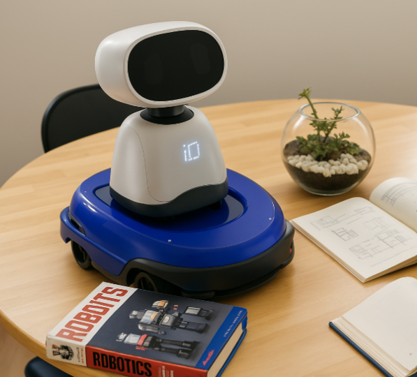

# MAGABot2

This repository contains the code and documentation developed during my internship at **IDMind**, focused on extending the capabilities of **Magabot**.

## About Magabot

Magabot is a low-cost, open-source mobile robotics platform originally designed to give mobility to any portable computer — the classic *“laptop on wheels”* concept.

You can find the original Magabot platform and documentation here:  
👉 [Original Magabot Repository](https://github.com/SvenThorkildsen/magabot)

During my collaboration at IDMind, we explored a new vision:  
The platform would no longer carry a laptop, but a **desktop robot**, turning Magabot into a mobile base for another robot.

## New System Architecture: Robot-on-Robot

The system is composed of three main units:

### Magabot Platform
- **Arduino UNO**  
  - Controls motors  
  - Acquires data from sonar, IR, and bumper sensors
- **ESP32**  
  - Acts as a **Wi-Fi to Serial bridge**  
  - No logic; forwards commands/data through HTTP posts

### Desktop Robot
- **Raspberry Pi 5**  
  - Main logic and high-level decision-making  
  - Real-time camera processing (Pi Camera)  
  - Runs a Flask server with web interface

## About my features
- The desktop robot is placed on top of the Magabot platform.
- A button is used to detect its presence.
- When the robot is detected:
  - A **Flask web server** is launched, and a web control panel becomes accessible with:
    - A **video stream**
    - A **manual driving mode**
    - A **“follow person” mode**
- The user can control the robot — for example, using their phone — by pressing the buttons, which send HTTP POST requests through the Flask web interface.

### Follow-Person Mode
- Implemented using a **pretrained SSD object detection model**
- The Raspberry Pi processes video in real time to identify and follow a person

### Dynamic Activation
- As soon as the desktop robot is **removed**, the connection is lost and the platform becomes idle, waiting for the next session.

All behaviors (camera, joystick, follow-person, bumper response, button state) are implemented using **Python threads**, **events**, and **monitors** to ensure reliable concurrent execution and safe switching between modes

CODE : arduino_slave.ino, esp32_bridge.ino, magabot_threads5.py

### Obstacle Avoidance Mode (Arduino + ESP32)
- A fully autonomous mode was implemented using:
  - 3 IR sensors
  - 2 bumpers
  - 5 sonar sensors
- The system includes a **finite state machine (FSM)** to:
  - Detect obstacles
  - Stop and back up
  - Calculate a safe direction
  - Move forward and resume navigation
  
CODE : arduino_autonomous.ino, esp32_bridge.ino

### LIDAR Integration
- In the last week, I implemented a **LIDAR data viewer**, designed to:
  - Stream scan data from the LiDAR sensor
  - Prepare the platform for future mapping and SLAM-based navigation
  
CODE : lidar_viewer.py

## Next steps
- Integrate the autonomous behaviour in the Raspberry and control panel
- Understand how to create a human-raspberry interaction (an idea could be voice recognition)
- Filter the LIDAR readings to have a clean map of the surroundings

